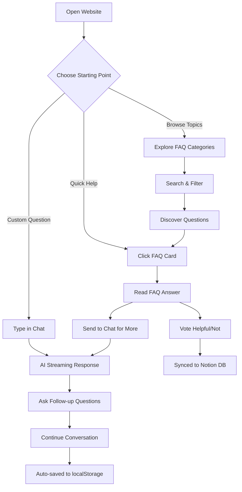

<div align="center"><a name="readme-top"></a>

# 🤖 Event Q&A AI Template<br/><h3>Reusable AI Assistant Template with Community-Driven FAQ</h3>

A **highly configurable template** for creating AI-powered Q&A assistants for any event.<br/>
Built with Next.js 16, featuring a full-screen chat interface with Google Gemini and community-driven FAQ voting system.<br/>
**Customize in minutes** - just edit config files. One-click **FREE** deployment on Vercel.

**Current Example**: AI Hackathon Festival 2025 (New Zealand)

[](docs/TEMPLATE-SETUP.md)
[](https://ai-hackathon-assistant.chanmeng-dev.workers.dev/)

<!-- SHIELD GROUP -->

[![][github-release-shield]][github-release-link]
[![][vercel-shield]][vercel-link]
[![][github-stars-shield]][github-stars-link]
[![][github-forks-shield]][github-forks-link]
[![][github-license-shield]][github-license-link]

**Share Event Q&A AI Template**

[![][share-x-shield]][share-x-link]
[![][share-linkedin-shield]][share-linkedin-link]
[![][share-reddit-shield]][share-reddit-link]

<sup>🌟 Create your own event AI assistant in minutes. Fully configurable template for any event.</sup>

</div>

## 📸 Project Screenshots

> [!TIP]
> Experience the full-screen AI chat interface and community-driven FAQ system in action.

<div align="center">
  
  <p><em>Main Interface - AI Chat (70%) + FAQ Sidebar (30%)</em></p>
</div>

<div align="center">
  
  
  <p><em>Mobile Views - Responsive Tabbed Interface</em></p>
</div>

**Tech Stack Badges:**

<div align="center">

 
 
 
 
 
 

</div>

> [!IMPORTANT]
> **This is a reusable template** - not just a single-purpose application. Clone it, edit a few config files, and deploy your own event Q&A AI in minutes. No code changes required for basic customization.

<div align="center">

### 🚀 Ready to create your own Event Q&A AI?

**👉 [Read the Quick Start Guide](docs/TEMPLATE-SETUP.md) 👈**

*5 minutes from clone to deployment*

</div>

<details>
<summary><kbd>📑 Table of Contents</kbd></summary>

#### TOC

- [🤖 Event Q&A AI Template](#-event-qa-ai-template)
  - [📸 Project Screenshots](#-project-screenshots)
  - [✨ Key Features](#-key-features)
  - [🔧 Template Configuration](#-template-configuration)
  - [🛠️ Tech Stack](#️-tech-stack)
  - [🏗️ Architecture](#️-architecture)
  - [🚀 Getting Started](#-getting-started)
  - [🛳 Deployment](#-deployment)
  - [📖 Usage Guide](#-usage-guide)
  - [🔌 Customization](#-customization)
  - [🤝 Contributing](#-contributing)
  - [📄 License](#-license)
  - [👥 Team](#-team)

####

<br/>

</details>

## ✨ Key Features

### `1` Full-Screen AI Chat Experience

Transform your hackathon experience with our revolutionary AI assistant powered by Google Gemini 2.5 Flash. Unlike traditional popup chatbots, our full-screen interface puts AI conversation at the center of your experience.

Key capabilities include:
- 🚀 **Real-time Streaming**: Character-by-character live responses
- 🎯 **Smart Suggestions**: Pre-populated question cards for quick start
- 💬 **Multi-line Input**: Auto-resizing textarea with Shift+Enter support
- 🔄 **Persistent History**: 50 messages saved locally across sessions
- ⚡ **Instant Integration**: FAQ questions flow seamlessly into chat

> [!TIP]
> Try asking: "How do I form a team for the hackathon?" or click any FAQ card to see the instant integration in action.

[![][back-to-top]](#readme-top)

### `2` Community-Driven FAQ System

Revolutionary FAQ management that evolves with your community. Users vote on helpful questions, automatically surfacing the most valuable content to the top.

<div align="center">
  
  <p><em>Community Voting in Action - Questions ranked by helpfulness</em></p>
</div>

**Available Features:**
- **Voting System**: 👍 Helpful / 👎 Not helpful with real-time sorting
- **Smart Search**: Find questions by keywords in title or content
- **Category Filter**: Browse by Event Info, Teams, Technical, etc.
- **View Tracking**: Popular questions rise to the top naturally
- **One-Click Chat**: Send any FAQ directly to AI for follow-up

[![][back-to-top]](#readme-top)

### `*` Additional Features

Beyond the core functionality, this project includes:

- [x] 💨 **Instant Setup**: Deploy in under 1 minute with one-click Vercel deployment
- [x] 🌐 **Responsive Design**: Perfect experience on desktop (70/30 split) and mobile (tabs)
- [x] 🔒 **Privacy First**: Chat data stored locally, votes synced to Notion
- [x] 💎 **Modern Animations**: Framer Motion powered micro-interactions
- [x] 🎨 **Beautiful UI**: shadcn/ui components with Tailwind CSS
- [x] 📊 **Notion Backend**: Real-time vote counts persisted to Notion database
- [x] 🔌 **Extensible**: Update FAQ through Notion UI without code changes
- [x] ⚡ **Performance Optimized**: 5-min caching, optimistic updates, lazy loading
- [x] 🛡️ **Graceful Fallback**: Works without Notion (static questions)

> ✨ Built as a reusable template - currently showcasing AI Hackathon Festival 2025 as an example configuration.

<div align="right">

[![][back-to-top]](#readme-top)

</div>

## 🛠️ Tech Stack

<div align="center">
  <table>
    <tr>
      <td align="center" width="96">
        
        <br>Next.js 16
      </td>
      <td align="center" width="96">
        
        <br>React 18
      </td>
      <td align="center" width="96">
        
        <br>TypeScript 5
      </td>
      <td align="center" width="96">
        
        <br>Tailwind CSS
      </td>
      <td align="center" width="96">
        
        <br>Gemini 2.5
      </td>
      <td align="center" width="96">
        
        <br>Notion API
      </td>
    </tr>
  </table>
</div>

**Frontend Stack:**
- **Framework**: Next.js 16.1.1 with App Router
- **Language**: TypeScript for type safety
- **Styling**: Tailwind CSS v3 + Framer Motion v12
- **UI Components**: shadcn/ui + Radix UI primitives
- **State Management**: React hooks + Local Storage

**AI Integration:**
- **AI SDK**: Vercel AI SDK v4.3 for streaming
- **AI Provider**: Google Gemini 2.5 Flash via @ai-sdk/google
- **Features**: Real-time streaming, context awareness
- **Performance**: Optimized for low-latency responses

**Backend Integration:**
- **Database**: Notion API (@notionhq/client v2.3)
- **FAQ System**: Community-driven voting with real-time stats
- **Caching**: 5-minute client-side cache with optimistic updates
- **Fallback**: Static questions when Notion unavailable

**DevOps & Performance:**
- **Deployment**: Vercel with automatic CI/CD
- **Performance**: Lazy loading, efficient bundling
- **Monitoring**: Built-in error boundaries
- **SEO**: Next.js App Router with metadata

> [!TIP]
> Each technology was carefully selected for developer experience, performance, and production readiness.

## 🔧 Template Configuration

> [!NOTE]
> **Zero Code Changes Required** - Customize everything through configuration files in the `config/` directory.

This template uses a centralized configuration system. All event-specific content is separated from code:

### Configuration Files

| File | Purpose | What to Configure |
|------|---------|-------------------|
| `config/site.config.ts` | Event information | Name, dates, venue, organizers, links |
| `config/ai.config.ts` | AI assistant | System prompt, model settings, knowledge base |
| `config/content.config.ts` | Static content | FAQ questions, testimonials, chat suggestions |
| `config/branding.config.ts` | Visual assets | Logos, developer credits, project links |

### Quick Configuration Example

**1. Event Information** (`config/site.config.ts`):
```typescript
export const siteConfig: SiteConfig = {
  name: 'Your Event Name 2025',
  shortName: 'Event 2025',
  tagline: 'Interactive Assistant',
  dates: {
    start: '2025-08-15',
    end: '2025-08-16',
    displayFormat: 'Aug 15-16, 2025',
  },
  venue: {
    name: 'Convention Center',
    address: '123 Main Street',
    city: 'Your City',
  },
  organizers: [
    { name: 'Your Organization', logo: '/images/organizers/org.svg' },
  ],
};
```

**2. AI Knowledge** (`config/ai.config.ts`):
```typescript
// Add event-specific knowledge for the AI
const additionalContext = `
## Event Rules
- Teams: 2-5 members
- Duration: 24 hours

## Prize Categories
- Grand Prize: $5,000
- Best Innovation: $2,000
`;
```

**3. Branding** (`config/branding.config.ts`):
```typescript
export const brandingConfig: BrandingConfig = {
  logos: {
    main: '/images/event/logo.svg',
    full: '/images/event/logo-full.svg',
  },
  showDeveloper: false,  // Hide developer credits if desired
};
```

### Image Directory Structure

```
public/images/
├── event/              # Your event logos
│   ├── logo.svg        # Header/icon logo
│   └── logo-full.svg   # Landing page logo
├── organizers/         # Organizer/sponsor logos
│   ├── org1.svg
│   └── org2.svg
└── developer/          # Optional developer branding
    └── logo.svg
```

> [!TIP]
> For detailed configuration instructions, see **[docs/TEMPLATE-SETUP.md](docs/TEMPLATE-SETUP.md)**

[![][back-to-top]](#readme-top)

## 🏗️ Architecture

```mermaid
graph TB
    subgraph "Configuration Layer"
        CFG[config/]
        CFG --> CFG1[site.config.ts]
        CFG --> CFG2[ai.config.ts]
        CFG --> CFG3[content.config.ts]
        CFG --> CFG4[branding.config.ts]
    end

    subgraph "Frontend Layer"
        A[Next.js App Router] --> B[React Components]
        B --> C[Tailwind Styling]
        C --> D[Framer Animations]
    end

    subgraph "AI Integration"
        E[Vercel AI SDK] --> F[Google Gemini 2.5 Flash]
        F --> G[Streaming Responses]
    end

    subgraph "Notion Backend"
        N1[Notion API Client]
        N2[(FAQ Database)]
        N3[Vote & View Tracking]
        N1 --> N2
        N1 --> N3
    end

    subgraph "API Routes"
        R1[/api/chat]
        R2[/api/faq/questions]
        R3[/api/faq/vote]
        R4[/api/faq/view]
    end

    subgraph "Data Layer"
        H[Local Storage] --> I[Chat History]
        H --> J[User Votes Cache]
        H --> K[FAQ Cache 5min]
    end

    subgraph "Deployment"
        L[Vercel Platform]
        M[Edge Functions]
    end

    CFG1 --> A
    CFG2 --> R1
    CFG3 --> B
    CFG4 --> B
    A --> E
    B --> H
    B --> R1
    B --> R2
    B --> R3
    B --> R4
    R1 --> F
    R2 --> N1
    R3 --> N1
    R4 --> N1
    L --> A
    L --> M
```

### Component Architecture

```
config/                        # 🔧 CONFIGURATION (edit these!)
├── index.ts                  # Unified exports
├── types.ts                  # TypeScript interfaces
├── site.config.ts            # Event name, dates, venue
├── ai.config.ts              # AI system prompt & settings
├── content.config.ts         # FAQ, testimonials, suggestions
└── branding.config.ts        # Logos, developer credits
app/                           # Next.js App Router
├── api/
│   ├── chat/                 # AI streaming endpoint (Gemini)
│   └── faq/                  # FAQ endpoints
│       ├── questions/        # GET - Fetch FAQ with stats
│       ├── vote/             # POST - Record votes
│       └── view/             # POST - Track views
├── chat/                     # Chat page (70/30 layout)
├── testimonials/             # Testimonials page
├── globals.css               # Global styles + color theme
├── layout.tsx                # Root layout (reads config)
└── page.tsx                  # Home/landing page (reads config)
components/                   # React components
├── chat/                    # EmbeddedChat, ChatSuggestions
├── faq/                     # FAQList, FAQCard (voting UI)
├── chatbot/                 # Chatbot, ChatMessage, types
└── ui/                      # shadcn/ui base components
hooks/                       # Custom React hooks
├── use-faq-voting.ts       # FAQ voting with Notion sync
└── use-scroll-direction.ts # Header visibility
lib/                         # Utilities
├── notion-faq.ts           # Notion client & operations
├── testimonials-data.ts    # Wrapper → contentConfig
└── utils.ts                # Helper functions (cn)
docs/                        # Documentation
├── TEMPLATE-SETUP.md       # Quick start guide
├── UI-DESIGN-SYSTEM.md     # Visual design guide
└── NOTION-INTEGRATION.md   # Notion backend docs
public/images/               # Static assets
├── event/                  # Event logos
├── organizers/             # Organizer logos
└── developer/              # Developer branding (optional)
```

## 🚀 Getting Started

### Prerequisites

> [!IMPORTANT]
> Ensure you have the following installed:

- Node.js 18.17+ ([Download](https://nodejs.org/))
- npm/yarn/pnpm package manager
- Google Gemini API key ([Get one here](https://aistudio.google.com/app/apikey))

### Quick Installation

**1. Clone Repository**

```bash
git clone https://github.com/ChanMeng666/event-qa-ai-template.git
cd event-qa-ai-template
```

**2. Install Dependencies**

```bash
# Using npm
npm install

# Using yarn
yarn install

# Using pnpm (recommended)
pnpm install
```

**3. Environment Setup**

```bash
# Copy environment template
cp .env.example .env.local

# Edit environment variables
nano .env.local
```

### Environment Setup

Create `.env.local` file with the following variables:

```bash
# Required: Google Gemini API Key
GOOGLE_GENERATIVE_AI_API_KEY=your_google_gemini_api_key_here

# Required for FAQ Backend: Notion Integration
NOTION_TOKEN=your_notion_integration_token
NOTION_FAQ_DATABASE_ID=your_notion_database_id

# Optional: Application settings
NODE_ENV=development
NEXTAUTH_URL=http://localhost:3000
NEXTAUTH_SECRET=your_secret_key_here
```

> [!TIP]
> - Get your Google Gemini API key from [Google AI Studio](https://aistudio.google.com/app/apikey)
> - Get Notion token from [Notion Integrations](https://www.notion.so/my-integrations)
> - See [docs/NOTION-INTEGRATION.md](docs/NOTION-INTEGRATION.md) for database setup
> - The app works without Notion (falls back to static questions)

**4. Start Development**

```bash
npm run dev
```

🎉 **Success!** Open [http://localhost:3000](http://localhost:3000) to view the application.

## 🛳 Deployment

> [!IMPORTANT]
> Choose the deployment strategy that best fits your needs. Vercel is recommended for seamless Next.js deployment.

### `A` One-Click Deployment

**Deploy to Vercel (Recommended)**

[](https://vercel.com/new/clone?repository-url=https%3A%2F%2Fgithub.com%2FChanMeng666%2Fevent-qa-ai-template)

### `B` Manual Deployment

**Vercel CLI:**

```bash
# Install Vercel CLI
npm i -g vercel

# Deploy
vercel --prod
```

**Other Platforms:**

<div align="center">

|           Deploy with Netlify            |                     Deploy with Railway                      |
| :---------------------------------------: | :-----------------------------------------------------------: |
| [](https://app.netlify.com/start/deploy?repository=https://github.com/ChanMeng666/event-qa-ai-template) | [](https://railway.app/new/template?template=https://github.com/ChanMeng666/event-qa-ai-template) |

</div>

### `C` Environment Variables

> [!WARNING]
> Never commit sensitive environment variables to version control. Use secure secret management in production.

| Variable | Description | Required | Example |
|----------|-------------|----------|---------|
| `GOOGLE_GENERATIVE_AI_API_KEY` | Google Gemini API key | ✅ | `AIza...` |
| `NOTION_TOKEN` | Notion Integration token | ✅ FAQ | `secret_xxx...` |
| `NOTION_FAQ_DATABASE_ID` | Notion FAQ database ID | ✅ FAQ | `abc123-...` |
| `NEXTAUTH_SECRET` | Session encryption secret | 🔶 | `generated-secret-key` |
| `NEXTAUTH_URL` | Application URL | 🔶 | `https://your-domain.vercel.app` |
| `NODE_ENV` | Environment mode | 🔶 | `production` |

> [!NOTE]
> ✅ Required, ✅ FAQ = Required for FAQ voting feature, 🔶 Optional
>
> Without Notion variables, the app uses static FAQ questions (no voting persistence).

## 📖 Usage Guide

### Main Interface

**Desktop Experience:**
- **AI Chat (70%)**: Full-screen conversational interface
- **FAQ Sidebar (30%)**: Community-driven question voting
- **Seamless Integration**: Click FAQ → flows into chat instantly

**Mobile Experience:**
- **Tab Navigation**: Swipe between Chat and FAQ views
- **Optimized Layout**: Full-screen on smaller devices
- **Gesture Support**: Native mobile interactions

<div align="center">
  
  <p><em>Desktop: AI Chat dominates with FAQ sidebar for quick access</em></p>
</div>

### AI Chat Features

**Getting Started:**

1. **Choose Your Path**: 
   - Click suggestion cards for instant common questions
   - Type custom questions in natural language
   - Send FAQ questions for detailed follow-up

2. **Advanced Features**:
   - **Multi-line Input**: Use Shift+Enter for line breaks
   - **Context Awareness**: AI remembers conversation history
   - **Instant Responses**: Real-time streaming from Google Gemini 2.5 Flash

**Example Interactions:**
```
User: "How do I form a team?"
AI: [Streams detailed team formation guidance]

User: "What if I don't have technical skills?"
AI: [Provides specific advice for non-technical participants]
```

### FAQ Voting System

**Community-Driven Ranking (Powered by Notion):**

| Feature | Description | Benefit |
|---------|-------------|---------|
| 👍 **Upvote** | Mark questions as helpful | Valuable content rises to top |
| 👎 **Downvote** | Flag less useful content | Improves overall quality |
| 📊 **Real-time Stats** | Vote counts synced to Notion | Persistent across sessions |
| 🔍 **Search** | Find by keywords | Quick access to specific topics |
| 🏷️ **Filter** | Browse by category | Organized content discovery |
| 💬 **Send to Chat** | One-click integration | Seamless AI follow-up |

> [!TIP]
> Votes are stored locally for privacy and synced to Notion for persistence. The system uses optimistic updates for instant feedback.

**Available Categories:**
- 📅 **Event Information**: Dates, schedule, logistics
- 👥 **Team Formation**: Finding teammates, roles, composition
- ⚙️ **Technical Details**: AI requirements, datasets, tools
- 🏆 **Awards & Judging**: Criteria, prizes, evaluation process
- 🎯 **Mentorship**: Getting help, Discord, support channels

### For Students and Mentors

**Students can get help with:**
- 🎯 **Getting Started**: First-time hackathon guidance
- 👥 **Team Building**: Finding the right teammates
- 💡 **Idea Development**: Brainstorming and validation
- ⚙️ **Technical Setup**: Tools, APIs, development environment

**Mentors can assist with:**
- 📚 **Resource Sharing**: Point to useful FAQ answers
- 🎓 **Teaching Moments**: Use chat for detailed explanations
- 🔍 **Quick References**: Browse FAQ for common student questions
- 💬 **Office Hours**: Efficient Q&A through familiar interface

### Interaction Flow



> [!TIP]
> **Pro Tip**: Start with FAQ browsing to discover common topics, then use chat for personalized follow-up questions. Your votes help improve the experience for everyone!

## 🔌 Customization

> [!NOTE]
> All customization is done through configuration files - no need to modify component code!

### Event Information

Edit `config/site.config.ts` to set your event's basic information:

```typescript
export const siteConfig: SiteConfig = {
  name: 'Your Event Name',
  shortName: 'Event',
  tagline: 'Your Tagline',
  description: 'Event description for SEO',
  dates: { start: '2025-08-15', end: '2025-08-16', displayFormat: 'Aug 15-16, 2025' },
  venue: { name: 'Venue Name', address: '123 Main St', city: 'City' },
  organizers: [{ name: 'Organization', shortName: 'Org', logo: '/images/organizers/org.svg' }],
};
```

### FAQ Questions & Testimonials

Edit `config/content.config.ts` to add or modify content:

```typescript
const presetQuestions: PresetQuestion[] = [
  {
    id: 'unique-id',
    category: 'event-info',
    question: 'When is the event?',
    answer: 'The event takes place on...',
  },
];

const testimonials: Testimonial[] = [
  {
    id: '1',
    quote: 'Amazing experience!',
    author: 'John Doe',
    role: 'participant',
    organization: 'Company X',
  },
];
```

### AI Assistant Behavior

Edit `config/ai.config.ts` to customize the AI's knowledge and personality:

```typescript
// Add event-specific knowledge
const additionalContext = `
## Event Rules
- Team size: 2-5 members
- Duration: 24 hours

## Prizes
- Grand Prize: $5,000
- Best Innovation: $2,000
`;

// Or override the entire system prompt
export const aiConfig: AIConfig = {
  // ...
  customSystemPrompt: 'Your completely custom system prompt here...',
};
```

### Color Theme

Edit `app/globals.css` to change the color scheme:

```css
:root {
  --primary: 221.2 83.2% 53.3%;       /* Main brand color */
  --primary-foreground: 210 40% 98%; /* Text on primary */
  /* Modify other colors as needed */
}
```

### Branding & Logos

Edit `config/branding.config.ts` to set your visual identity:

```typescript
export const brandingConfig: BrandingConfig = {
  logos: {
    main: '/images/event/logo.svg',      // Header icon
    full: '/images/event/logo-full.svg', // Landing page
    favicon: '/images/event/logo.svg',
  },
  showDeveloper: false,  // Hide developer credits
};
```

### Adding New Categories

Edit `config/content.config.ts`:

```typescript
const categories: Record<string, string> = {
  'event-info': 'Event Info',
  'teams': 'Teams',
  'your-new-category': 'Your Category Name',  // Add new category
};
```

> [!TIP]
> For complete configuration reference, see **[docs/TEMPLATE-SETUP.md](docs/TEMPLATE-SETUP.md)**

## 🤝 Contributing

We welcome contributions! Here's how you can help improve this project:

### Development Process

**1. Fork & Setup:**

```bash
# Fork the repository on GitHub
git clone https://github.com/YOUR_USERNAME/event-qa-ai-template.git
cd event-qa-ai-template

# Install dependencies
pnpm install

# Create environment file
cp .env.example .env.local
# Add your API keys
```

**2. Create Feature Branch:**

```bash
git checkout -b feature/amazing-new-feature
```

**3. Development Guidelines:**

- ✅ Follow TypeScript best practices
- ✅ Add comprehensive tests for new features
- ✅ Use consistent code formatting (Prettier + ESLint)
- ✅ Include JSDoc comments for public APIs
- ✅ Follow accessibility guidelines (WCAG 2.1)

**4. Submit Pull Request:**

- Provide clear description of changes
- Include screenshots for UI changes
- Reference related issues
- Ensure all checks pass

### Contribution Areas

| Type | Description | Examples |
|------|-------------|----------|
| 🐛 **Bug Fixes** | Fix existing issues | API errors, UI glitches, performance |
| ✨ **New Features** | Add functionality | New categories, UI improvements |
| 📚 **Documentation** | Improve guides | README updates, code comments |
| 🎨 **Design** | Visual improvements | Better animations, color schemes |
| ⚡ **Performance** | Optimize speed | Bundle size, loading times |

### Code of Conduct

- Be respectful and inclusive
- Provide constructive feedback
- Help newcomers learn and contribute
- Focus on the project's goals

## 📄 License

This project is licensed under the MIT License - see the [LICENSE](LICENSE) file for details.

**Open Source Benefits:**
- ✅ Commercial use allowed
- ✅ Modification allowed  
- ✅ Distribution allowed
- ✅ Private use allowed

## 👥 Team

<div align="center">
  <table>
    <tr>
      <td align="center">
        <a href="https://github.com/ChanMeng666">
          
          <br />
          <sub><b>Chan Meng</b></sub>
        </a>
        <br />
        <small>Creator & Lead Developer</small>
      </td>
    </tr>
  </table>
</div>

**Author Contact:**
- 🌐 **Website**: [chanmeng.org](https://chanmeng.org/)
- 💼 **LinkedIn**: [chanmeng666](https://www.linkedin.com/in/chanmeng666/)
- 📧 **Email**: [chanmeng.dev@gmail.com](mailto:chanmeng.dev@gmail.com)
- 🔗 **GitHub**: [ChanMeng666](https://github.com/ChanMeng666)

---

<div align="center">
<strong>🚀 Create Your Own Event Q&A AI in Minutes 🌟</strong>
<br/>
<em>A reusable template for AI-powered event assistance</em>
<br/><br/>

⭐ **Star us on GitHub** • 📖 **Read the [Setup Guide](docs/TEMPLATE-SETUP.md)** • 🐛 **Report Issues** • 💡 **Request Features** • 🤝 **Contribute**

<br/><br/>

**Made with ❤️ by Chan Meng**

[](https://github.com/ChanMeng666/event-qa-ai-template/stargazers)
[](https://github.com/ChanMeng666/event-qa-ai-template/forks)
[](https://github.com/ChanMeng666)

</div>

---

<!-- LINK DEFINITIONS -->

[back-to-top]: https://img.shields.io/badge/-BACK_TO_TOP-151515?style=flat-square

<!-- GitHub Links -->
[github-release-link]: https://github.com/ChanMeng666/event-qa-ai-template/releases
[github-stars-link]: https://github.com/ChanMeng666/event-qa-ai-template/stargazers
[github-forks-link]: https://github.com/ChanMeng666/event-qa-ai-template/forks
[github-license-link]: https://github.com/ChanMeng666/event-qa-ai-template/blob/main/LICENSE

<!-- Deployment Links -->
[vercel-link]: https://ai-hackathon-assistant.chanmeng-dev.workers.dev/

<!-- Shield Badges -->
[github-release-shield]: https://img.shields.io/github/v/release/ChanMeng666/event-qa-ai-template?color=369eff&labelColor=black&logo=github&style=flat-square
[vercel-shield]: https://img.shields.io/badge/vercel-online-55b467?labelColor=black&logo=vercel&style=flat-square
[github-stars-shield]: https://img.shields.io/github/stars/ChanMeng666/event-qa-ai-template?color=ffcb47&labelColor=black&style=flat-square
[github-forks-shield]: https://img.shields.io/github/forks/ChanMeng666/event-qa-ai-template?color=8ae8ff&labelColor=black&style=flat-square
[github-license-shield]: https://img.shields.io/badge/license-MIT-white?labelColor=black&style=flat-square

<!-- Social Share Links -->
[share-x-link]: https://x.com/intent/tweet?hashtags=opensource,ai,template&text=Create%20your%20own%20event%20Q%26A%20AI%20in%20minutes%20with%20this%20reusable%20template&url=https%3A%2F%2Fgithub.com%2FChanMeng666%2Fevent-qa-ai-template
[share-linkedin-link]: https://linkedin.com/sharing/share-offsite/?url=https://github.com/ChanMeng666/event-qa-ai-template
[share-reddit-link]: https://www.reddit.com/submit?title=Event%20Q%26A%20AI%20Template%20-%20Reusable%20AI%20Assistant&url=https%3A%2F%2Fgithub.com%2FChanMeng666%2Fevent-qa-ai-template

[share-x-shield]: https://img.shields.io/badge/-share%20on%20x-black?labelColor=black&logo=x&logoColor=white&style=flat-square
[share-linkedin-shield]: https://img.shields.io/badge/-share%20on%20linkedin-black?labelColor=black&logo=linkedin&logoColor=white&style=flat-square
[share-reddit-shield]: https://img.shields.io/badge/-share%20on%20reddit-black?labelColor=black&logo=reddit&logoColor=white&style=flat-square
