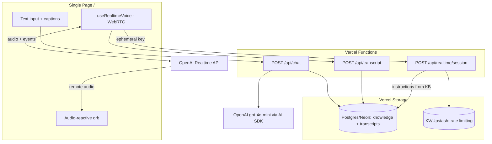

<div align="center"><a name="readme-top"></a>

# Aotearoa AI Hackathon Festival 2026 - Voice AI Agent

A single-page, voice-first AI agent for the **Aotearoa AI Hackathon Festival 2026** (AUT City Campus).
Talk or type to an interactive orb that answers questions about the event - speech in, speech out, with live captions.

Built with **Next.js 16**, the **OpenAI Realtime API** (speech-to-speech), the **Vercel AI SDK**, and **Vercel** platform services (Postgres/Neon, KV/Upstash, Analytics, Speed Insights).

[](https://aihackathon-2026.vercel.app)


</div>

## What it is

The entire site is one page: a centered, audio-reactive orb.

- Tap the orb (or the mic button) to start a **two-way voice conversation** powered by the OpenAI Realtime API over WebRTC. The orb pulses and shifts color with the live audio.
- Or **type** a question - the same agent answers, with the reply shown as text and, when in a voice session, spoken aloud.
- Live **captions** show both your words and the agent's.
- A subtle **Event Info** panel exposes the essential facts (dates, venue, register link).

All AI is OpenAI. No other model providers are used.

## Architecture



- **Voice**: `app/api/realtime/session/route.ts` mints a short-lived ephemeral client secret from `POST /v1/realtime/client_secrets` (the real `OPENAI_API_KEY` never reaches the browser). The client (`hooks/use-realtime-voice.ts`) then exchanges SDP with `POST /v1/realtime/calls` and streams audio directly to OpenAI.
- **Text**: `app/api/chat/route.ts` uses the Vercel AI SDK (`streamText`) with `gpt-4o-mini`.
- **Knowledge**: `lib/knowledge.ts` builds the agent instructions from the DB `knowledge` table when available, otherwise from `config/ai.config.ts`.
- **Persistence**: `lib/transcripts.ts` best-effort stores conversation turns in Postgres. Everything degrades gracefully when storage is unconfigured.

## Project structure

```
app/
  page.tsx                     # The single page (orb + agent)
  layout.tsx                   # Metadata, fonts, Analytics + Speed Insights
  opengraph-image.tsx          # Dynamic OG image (next/og)
  api/
    realtime/session/route.ts  # Mint ephemeral Realtime token (rate-limited)
    chat/route.ts              # Text chat (Vercel AI SDK + OpenAI)
    transcript/route.ts        # Persist voice transcripts
components/
  agent/
    voice-agent.tsx            # Orchestrates orb + controls + captions
    agent-orb.tsx              # Audio-reactive Three.js orb
    info-panel.tsx             # Collapsible event-info overlay
  three/cosmic-background.tsx  # Background
hooks/
  use-realtime-voice.ts        # WebRTC realtime session + audio level
lib/
  db.ts                        # Neon client + schema (graceful fallback)
  knowledge.ts                 # KB loader + instruction builder
  transcripts.ts               # Conversation persistence
  ratelimit.ts                 # Upstash rate limiting (allow-all fallback)
config/
  site.config.ts               # Event facts (2026)
  ai.config.ts                 # Prompt/knowledge + realtime model/voice
  content.config.ts            # Suggested prompts
  branding.config.ts           # Logos, links, deployment URL
scripts/
  seed-knowledge.ts            # Seed the knowledge table (npm run db:seed)
```

## Getting started

```bash
npm install
cp .env.example .env.local   # add OPENAI_API_KEY
npm run dev
```

Open http://localhost:3000. The voice agent needs microphone permission and a secure context (localhost is fine).

### Environment variables

| Variable | Required | Purpose |
|----------|----------|---------|
| `OPENAI_API_KEY` | Yes | Realtime voice + text chat |
| `DATABASE_URL` / `POSTGRES_URL` | Optional | Vercel Postgres (Neon): knowledge base + transcripts. Falls back to static config. |
| `KV_REST_API_URL` / `KV_REST_API_TOKEN` | Optional | Vercel KV (Upstash): rate limiting. Falls back to allow-all. |

## Deploying on Vercel

The project must be linked to **`she-sharp1/aihackathon-2026`** (not `event-qa-ai-template`).

```bash
# Link to the correct project (once)
npx vercel link --project aihackathon-2026 --scope she-sharp1 --yes

# Set the OpenAI key (once) — or use npm run sync:vercel-env
vercel env add OPENAI_API_KEY production --scope she-sharp1

# Deploy
vercel deploy --prod --scope she-sharp1
```

To enable the database and rate limiting, add the **Vercel Postgres (Neon)** and **Vercel KV (Upstash)** integrations from the Vercel dashboard (Storage tab). They inject the env vars automatically. Then seed the knowledge base:

```bash
vercel env pull .env.local --scope she-sharp1
npm run db:seed
```

## Editing the event knowledge

- Quick edits: update `config/ai.config.ts` (`additionalContext`) and `config/site.config.ts`.
- Live edits (no redeploy) once Postgres is connected: update rows in the `knowledge` table (or re-run `npm run db:seed`).

## License

MIT - see [LICENSE](LICENSE).

---

<!-- CHAN MENG PERSONAL BRAND -->
<div align="center">
  <a href="https://github.com/ChanMeng666" target="_blank">
    
  </a>

  <p><strong>Chan Meng</strong><br/>Need a custom app like this one? I build them - let's talk.</p>

  <a href="mailto:chanmeng.dev@gmail.com"></a>
  <a href="https://github.com/ChanMeng666"></a>
</div>
<!-- /CHAN MENG PERSONAL BRAND -->
